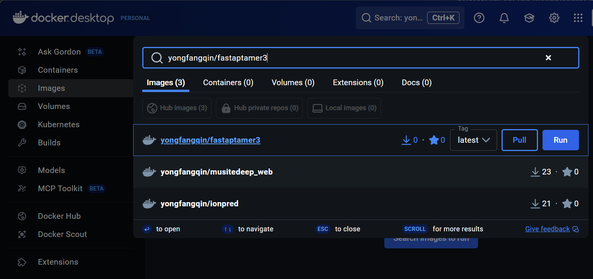
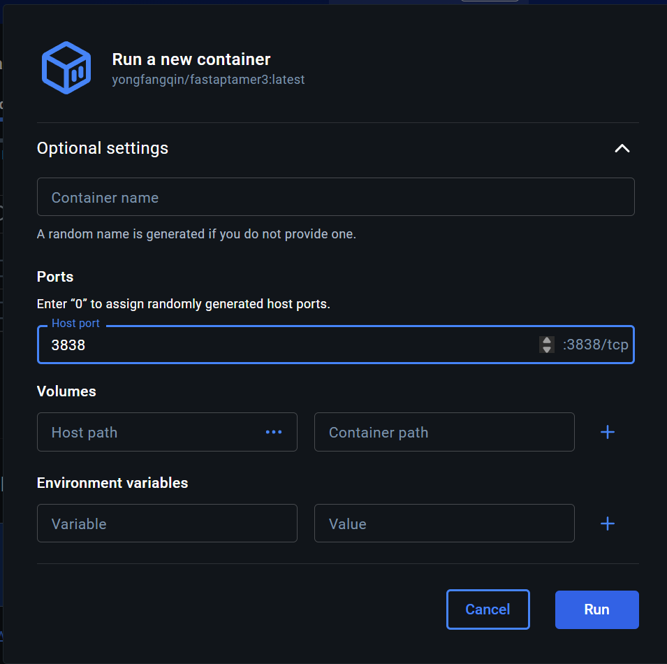

# FASTAptameR3 — Docker Quick Start Guide

> **For Windows & macOS users**  
> This guide helps you install Docker Desktop, run FASTAptameR3, and access the web interface.

## 📋 Table of Contents

1. [What is Docker?](#what-is-docker)
2. [System Requirements](#system-requirements)
3. [Install Docker Desktop](#install-docker-desktop)
4. [Find & Pull the Image](#find--pull-the-image)
5. [Run the Container](#run-the-container)
6. [Access the App](#access-the-app)
7. [Manage Containers](#manage-containers)
8. [Troubleshooting](#troubleshooting)

---

## What is Docker? {#what-is-docker}

**Docker** packages software and all dependencies into a single container, avoiding installation hassles and version conflicts.

**Benefits for FASTAptameR3:**
- No need to install R or libraries
- Works the same on Windows, macOS, and Linux
- Easy updates and sharing

---

## System Requirements {#system-requirements}

- **Administrative rights** to install applications
- **Stable internet connection** (to download Docker Desktop and the FASTAptameR3 image)
- Disk space: ~2–5 GB free
- Windows and macOS specifics are below

---

## Install Docker Desktop {#install-docker-desktop}

### 🪟 Windows 10/11

1. **Download:** Go to [Docker Desktop](https://www.docker.com/products/docker-desktop/) and download the Windows installer
2. **Install:** Run the installer with default settings
   - Accept WSL 2 installation if prompted
   - Restart your computer when asked
3. **Launch:** Open Docker Desktop after restart
   - Create a free Docker Hub account if prompted
4. **Verify:** Look for the whale icon in system tray showing "Docker Desktop is running"

> **Note:** WSL 2 is required and usually installs automatically. If not, see [Microsoft's WSL docs](https://aka.ms/wslinstall).

### 🍎 macOS (Intel or Apple Silicon)

1. **Download:** Go to [Docker Desktop](https://www.docker.com/products/docker-desktop/)
2. **Choose correct version:**
   - **Apple Silicon (M1/M2/M3):** Download Apple chip build
   - **Intel Mac:** Download Intel build
3. **Install:** Open `.dmg`, drag to Applications, then launch
4. **Permissions:** Grant network permissions when macOS asks
5. **Verify:** Whale icon should show "Docker Desktop is running"

> **Note:** Apple Silicon users may need to install Rosetta if prompted.

---

## Find & Pull the Image {#find--pull-the-image}

**Repository:** `yongfangqin/fastaptamer3:latest`

### 🖱️ Method 1: Docker Desktop (Recommended)

1. Open Docker Desktop → **Images** tab
2. Click **Pull** or use the search bar
3. Search for `yongfangqin/fastaptamer3`
4. Click **Pull** and wait for download

<div align="center">
  
  <br><em>Search for yongfangqin/fastaptamer3 in Docker Desktop</em>
</div>

### 💻 Method 2: Command Line (Optional)

```bash
docker pull yongfangqin/fastaptamer3:latest
```

---

## Run the Container {#run-the-container}

**Port:** FASTAptameR3 runs on port `3838` inside the container

### 🖱️ Method 1: Docker Desktop (Recommended)

1. Go to **Images** → Find `yongfangqin/fastaptamer3` → Click **Run**
2. In the Run dialog:
   - Expand **Optional settings**
   - Set **Host port** to `3838` (or another free port like `3839`)
   - Ensure container port shows `:3838/tcp`
3. Click **Run**
4. Wait for status to show "Running" in **Containers** tab

<div align="center">
  
  <br><em>Configure port mapping: Host port 3838 → Container port 3838</em>
</div>

### 💻 Method 2: Command Line

```bash
docker run --rm -p 3838:3838 yongfangqin/fastaptamer3:latest
```

**Explanation:**
- `-p 3838:3838` maps your computer's port 3838 to the app's port 3838
- `--rm` automatically removes the container when stopped

---

## Access the App {#access-the-app}

1. **Open browser** to `http://localhost:3838`
   - If you used a different port (e.g., 3839): `http://localhost:3839`
2. **Start using** the FASTAptameR3 interface

> ✅ **Success!** You should see the FASTAptameR3 web interface.

---

## Manage Containers {#manage-containers}

### 🛑 Stop the App
- **Docker Desktop:** Go to **Containers** → Click stop button (⏹️)
- **Command line:** Press `Ctrl + C` or run `docker stop <container_name>`

### 🔄 Update to Latest Version
1. Stop running containers
2. Pull latest image: `docker pull yongfangqin/fastaptamer3:latest`
3. Run new container

### 🧹 Clean Up (Optional)
- **Docker Desktop:** Use **Delete** button on stopped containers/unused images
- **Command line:** `docker system prune` (removes unused containers/images)

---

## Troubleshooting {#troubleshooting}

### 🚫 Port Already in Use
**Problem:** Browser shows error or Docker won't start  
**Solution:** Use a different port (e.g., 3839) in Run dialog or command: `-p 3839:3838`

### 🐳 Docker Desktop Not Running
**Problem:** Pulls/starts fail, whale icon shows error  
**Solution:** Open Docker Desktop, wait for "Docker Desktop is running" status

### 🐌 App Runs Slowly
**Problem:** App feels slow or crashes  
**Solution:** Docker Desktop → **Settings** → **Resources** → Increase CPU/Memory

### 🌐 Network Issues
**Problem:** Pull fails or very slow  
**Solution:** Try different network (home/hotspot) or contact IT for Docker Hub access

### 🍎 Apple Silicon Issues
**Problem:** Architecture warnings  
**Solution:** Ensure you downloaded the correct Docker Desktop build for Apple Silicon

---

## 📞 Need Help?

If something doesn't work, please share:
- **OS:** Windows/macOS version
- **Docker Desktop version**
- **What you tried** and what you saw (screenshots help!)

---

> **💡 Tip:** This guide is designed for beginners. If any step is confusing, let us know so we can improve it!


